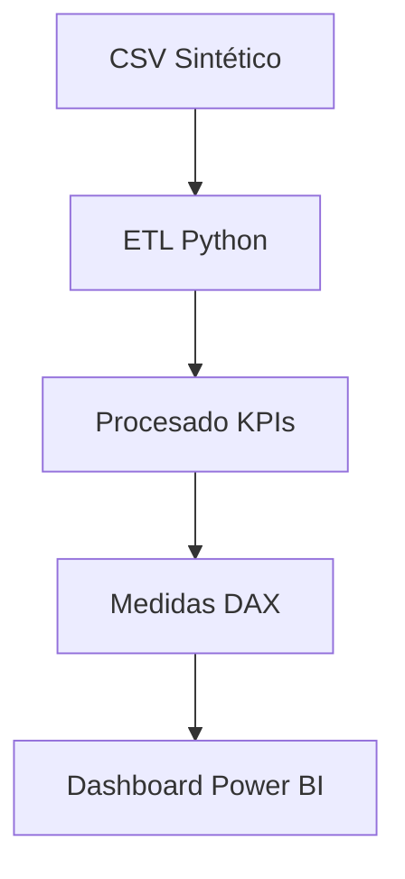

# Decisiones de Arquitectura

- **Datos sintéticos** para evitar restricciones de privacidad.
- **KPIs robustos**: además del CV tradicional, se calcula el **CVM** basado en mediana y MAD.
- **Outliers**: enfoque IQR por equipo/semana para alertas.
- **Segmentación**: cuartiles para priorización de coaching y asignación.
- **Entrevista**: repo lista para demo con CI y pruebas.

## Diagrama
